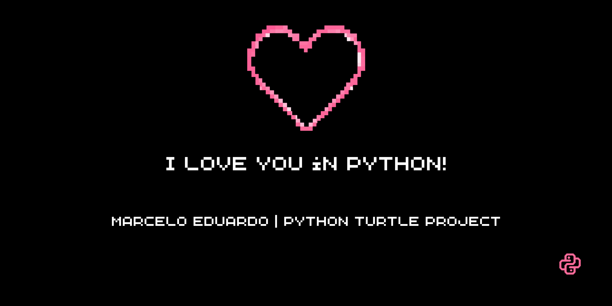
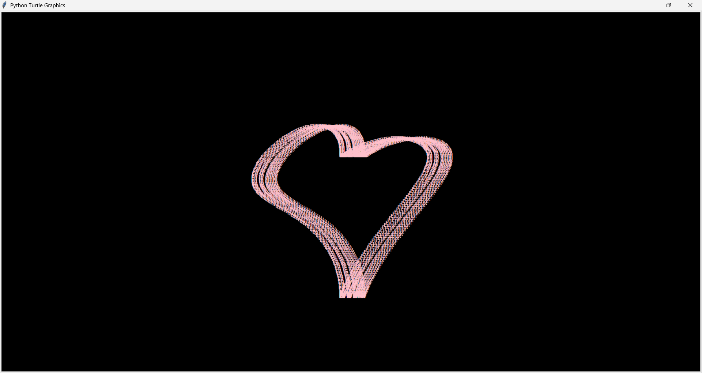

<p align="center">
  
</p>

# love-you-python-turtle
Um repositório criado para armazenar meu primeiro projeto utilizando a biblioteca **Turtle**!

# Sobre o projeto

O objetivo deste projeto é demonstrar de forma prática como criar uma arte visual e formas utilizando funções matemáticas.

O desenho do coração é gerado a partir de equações matemáticas, transformando cálculos em coordenadas que são exibidas graficamente pela biblioteca "turtle".

# Tecnologias utilizadas

- Python 3
- Biblioteca Turtle
- Módulo Math

# Resultado!



# Como executar

1. Clone este repositório:

```bash
git clone https://github.com/eduardomarcelo628-beep/love-you-python-turtle.git
```

2. Acesse a pasta do projeto:

```bash
cd love-you-python-turtle
```

3. Execute o arquivo Python:

```bash
python love-you-python-turtle.py
```

# Conceitos praticados

- Laços de repetição (`for`)
- Funções matemáticas
- Coordenadas cartesianas
- Programação gráfica
- Uso de bibliotecas em Python

# Objetivo

Este projeto faz parte dos meus estudos em Python e tem como finalidade praticar lógica de programação, programação matemática e programação visual.

---

Desenvolvido com ❤️ e Python.

# Autor

**Marcelo Eduardo**

- GitHub: https://github.com/eduardomarcelo628-beep
- LinkedIn: https://www.linkedin.com/in/marcelo-eduardo-a03978246/
